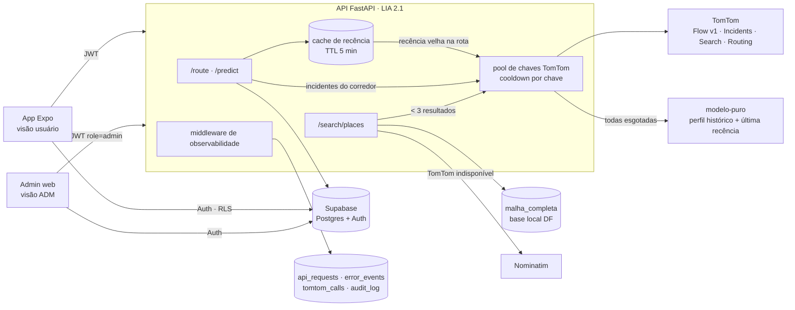

# Análise — Routify, fase final do TCC 2 (plataforma usuário + ADM)

**Última revisão:** 2026-09-22 · Status: **proposta — aguardando decisões** (ver §10)

Fontes: código `main` + snapshot `origin/tcc2`; Valerium-Portal (design/auth/deploy); GrovOps (observabilidade); tpotce-TCC (painel admin/data quality); docs TomTom (links no fim); feedback do orientador sobre o Resumo Técnico TCC 2.

---

## 1. Resumo executivo

1. A `tcc2` (Pedro) é uma **branch órfã**, sem histórico em comum com `main`. Dá pra integrar com enxerto (`git replace --graft`) + merge 3-way: **3 conflitos**, o resto mescla limpo. O snapshot dele não builda sozinho (falta `FrontEnd/src/lib/`, que o main tem).
2. **Riscos críticos antes de qualquer feature:** API sem auth + CORS aberto; `route_history` escrito pelo cliente (dados da tese corrompíveis); RLS das tabelas de tráfego desconhecido com anon key pública.
3. **Banco: ficar só no Supabase.** MongoDB não resolve nenhum problema que o Postgres (jsonb + RLS + Auth) não resolva, e dobra a operação.
4. **Hospedagem:** o plano Hostinger Business roda Node, **não Python**. Front + admin cabem lá; a API ML precisa de VPS ou de um host com ≥ 4 GB de RAM.
5. **TomTom sob demanda:** Flow Segment Data (Genesis v1) nas arestas da rota com recência velha + Incidents (Orbis) por corredor + Search no autocomplete. Degradação vira "modelo-puro". **Verificar se a cota free é diária ou mensal** e registrar o risco de ToS do pool de chaves.
6. **Feedback do orientador** vira entregável rápido: script de figuras (MAE/RMSE por versão, curva isotônica, LSTM × XGB), diagrama de arquitetura e seção de limitações. A página "Modelo" do ADM reaproveita os mesmos gráficos.

## 2. `tcc2` × `main`

| Item | Fato |
|---|---|
| Ancestralidade | `aefb465` (raiz, sem pai) → `65b387a`. Sem merge-base. Snapshot parecido com `66d30c0` (2026-05-06) |
| Faltam no tcc2 (vieram depois) | `75c92d8` (fix do `.gitignore` `lib/` → `FrontEnd/src/lib/*` versionado) e `d0fb247` (guard anti-sobreposição + rotação de chaves robusta) |
| tcc2 traz | LIA 2.0/2.1 (alvo = razão, perfis, recência), `recencia_cache.py`, `graph_enrichment.py`, `lia_inference.py`, calibração isotônica, Optuna, benchmark LSTM, Fase 3 (validação × TomTom Routing), `002_validacao_tese.sql`, `deploy/` systemd, READMEs, `.env.example`, HistoryScreen expandida |
| Conflitos (base `66d30c0`) | `Servidor/main.py` → **união** (`coleta_protegida` do main + jobs Fase 3 do Pedro). `traffic_collector.py` → **escolher uma versão inteira** (recomendo a do main: cooldown graduado + retry + UTC reset; portar do Pedro as frases "insufficientfunds"/"credits" e o cap de rotações). `lia_1.0_metadata.json` → **tcc2** (os números do PDF derivam dele) |
| Pós-merge | Atualizar o tipo `RouteHistoryRow` (colunas de validação do 002); remover o código morto (`eta_google_seg`, transfer duplicado em `route.py`); corrigir o `Dockerfile` `LIA_VERSION` |

Procedimento: branch local `integracao/tcc2` a partir de `main` → `git replace --graft aefb465 66d30c0` → `git merge origin/tcc2` → resolver → `git replace -d aefb465` → testar a API e o app → só então abrir PR/merge no `main` (push só com OK).

## 3. Achados críticos

| # | Achado | Impacto | Ação |
|---|---|---|---|
| C1 | O RLS de `historico_trafego`/`vias_monitoradas`/`malha_completa` é desconhecido; o app usa anon key pública | Qualquer um poderia ler/apagar o dataset da tese | Checar via MCP (read-only) **antes de tudo**; backup (parquet/pg_dump); versionar a DDL + RLS |
| C2 | API sem auth, CORS `*` + credentials, sem rate-limit | Abuso da API; queima das chaves TomTom quando virar sob demanda | JWT Supabase (JWKS) + allowlist de CORS + rate-limit por IP/usuário |
| C3 | `route_history` 100% escrito pelo cliente | Métrica de validação da tese forjável | A API persiste (service role); o cliente só faz SELECT próprio + UPDATE limitado (feedback) |
| C4 | `Dockerfile` com default `lia_1.0` | Deploy sobe o modelo errado | Default `lia_2.1` + `/health` expondo a versão |
| C5 | Tamanho do banco desconhecido (teórico: 630 pts × 180 ciclos/dia ≈ 113 mil linhas/dia) | Free tier = 500 MB; logs novos podem estourar | Medir `pg_database_size` + tabelas; política de retenção |
| C6 | Métricas: LIA 2.0 sem CV persistido; 2.1 anterior ao Optuna; "Erro médio" do PDF = RMSE | Números da banca inconsistentes | Re-rodar o CV das duas versões e persistir MAE+RMSE+baseline; corrigir o rótulo no texto |

## 4. Banco: Supabase só (sem MongoDB)

| Critério | Supabase (Postgres) | + MongoDB |
|---|---|---|
| Auth/RLS | nativo, já em uso | não tem; exigiria 2º modelo de auth/ownership |
| Rotas/uso | `route_history` já existe; jsonb p/ polyline; PostGIS se precisar de consulta espacial | documento natural, mas sem join com o tráfego |
| Observabilidade | tabelas append-only + views/`pg_cron` p/ agregação | coleção de eventos — mas o volume de TCC é pequeno |
| Operação | 1 banco, 1 backup, 1 MCP | 2 bancos, sync, 2 custos |

**Decisão proposta:** só Supabase. Os logs do ADM vão em tabelas próprias com retenção (ex.: 90 dias em bruto, agregados diários para sempre). O GrovOps chegou à mesma conclusão (Mongo rejeitado por não ter realtime/cron; Supabase + Realtime atende). Mongo só faria sentido se o volume de telemetria explodisse o plano — não é o caso de um TCC.

## 5. Arquitetura alvo



Esse diagrama já responde ao pedido do orientador (cache de recência, rotação defensiva de chaves, fallback da busca). A versão final vai pro `Docs/core/architecture.md` + SVG pro texto.

**Monorepo (proposta):**

```
apps/api/          ← BackEnd/API            (Python · FastAPI)
apps/mobile/       ← FrontEnd               (Expo · visão usuário)
apps/admin/        NOVO                     (Next.js · visão ADM · design Valerium)
services/collector ← BackEnd/Servidor       (pausado; reaproveita a rotação de chaves)
ml/                ← BackEnd/Treinamento_IA
supabase/migrations← BackEnd/sql
```

- Renomear pasta quebra os caminhos que o Pedro e o texto da tese citam. Alternativa mínima: manter `BackEnd/`/`FrontEnd/` e só adicionar `apps/admin/` (decisão §10).
- Tooling JS: Bun workspaces + Turbo (padrão Valerium/GrovOps; o `bunfig.toml` com `minimumReleaseAge` protege contra supply-chain). Python com `uv`.

**Hospedagem:**

| Peça | Onde | Por quê |
|---|---|---|
| App web (Expo export estático) | Hostinger Business (subdomínio) | estático, custo zero extra |
| Admin (Next.js standalone) | Hostinger Business — app Node/Passenger | mesmo modelo de deploy já provado no Valerium |
| API Python + grafo 38 km | **VPS** (Hostinger KVM 2, Docker) ou Hugging Face Spaces (CPU grátis, 16 GB, dorme sem uso) ou Oracle free (o plano do Pedro, sem capacidade no momento) | Business não roda Python; grafo + modelo pedem ≥ 2–4 GB |
| Deploy | GitHub Actions: lint → build → rsync SSH → restart Passenger → smoke **de dentro do servidor** (lições do Valerium: edge `hcdn` barra IP do runner, `NEXT_PUBLIC_*` no step de build, sem top-level await) | reaproveita o workflow provado |

## 6. Auth "redonda" + Resend (conta nova)

- **Supabase Auth continua** (o app já usa `signInWithPassword`/`signUp`). Completar: confirmação de e-mail, reset de senha com deep link, troca de e-mail, OTP por e-mail (opcional), Google OAuth (opcional), CAPTCHA Turnstile no cadastro (opcional).
- **E-mails do próprio Auth via Resend:** Supabase Studio → Auth → SMTP (`smtp.resend.com:465`, user `resend`, senha = API key da **conta Resend nova**) + templates PT-BR com a marca Routify. O Valerium **não** fez isso (usa o e-mail padrão do Supabase); aqui vale fazer. Requer domínio verificado (SPF/DKIM) → decidir o domínio (subdomínio de um domínio existente ou domínio próprio).
- **Papel ADM:** `auth.users.raw_app_meta_data.role = 'admin'` (só o service role grava; vai no JWT como `app_metadata.role`). A API checa o claim; as policies RLS usam `auth.jwt() -> 'app_metadata' ->> 'role'`. Nada de coluna `role` em `profiles` (editável pelo dono).
- **LGPD:** texto de consentimento na tela Privacy, retenção de `route_history` configurável e botão "apagar meu histórico" (já existe delete no HistoryScreen).

## 7. Visão ADM — módulos

| Página | Mostra | Fonte |
|---|---|---|
| Visão geral | buscas 24h/7d, usuários ativos, p95 de latência, % erro, cobertura LIA média, chaves TomTom disponíveis | `api_requests`, `tomtom_key_state` |
| **Data Quality** | frescor por via (última obs.), lacunas > N min por via/dia, heatmap hora×dia de cobertura, % nulos/zeros, outliers (razão fora de 0,05–1; vel. > 1,5× livre), duplicatas `(id_ponto, ts)`, vias sem dado, distribuição do `confidence` TomTom, tamanho/crescimento das tabelas | views/RPC `dq_*` (security definer, só admin) sobre `historico_trafego`; materializadas via `pg_cron` se pesar |
| **Buscas** | últimas buscas (coordenadas arredondadas), top corredores (agregado por região), buscas/hora, % em que a rota LIA ≠ menor distância, ganho previsto, **erro real com feedback** (`tempo_real_seg` × previsto) | `api_requests`, `route_history` |
| **Erros** | eventos agrupados por fingerprint (tipo + local), contagem, primeiro/último visto, status HTTP, falhas TomTom por tipo | `error_events` (upsert por fingerprint — o GrovOps sofreu com "11 incidentes do mesmo bug") |
| **Modelo** | métricas por versão (MAE/RMSE × baseline), curva isotônica, LSTM × XGB, % arestas model/transfer/fallback, hit-rate do cache de recência, drift (razão ao vivo × perfil histórico) | `models/*.json` + `api_requests` |
| **TomTom** | chamadas/dia por chave (id, nunca o valor), 429/403, cooldown até, orçamento restante, hit do cache | `tomtom_calls`, `tomtom_key_state` |
| **Benchmark externo** | atraso por congestionamento LIA × TomTom Routing (continua o experimento da Fase 3) | tabela de amostras da Fase 3 |
| Usuários + Auditoria | cadastros, ativos, bloquear usuário; toda ação ADM registrada | `auth.users` (via RPC admin), `audit_log` append-only |

Stack do admin: Next.js + tokens/componentes do Valerium (shadcn + `ChartContainer`/`ChartConfig` + Recharts, paleta monocromática, `--chart-*`). Atualização ao vivo via Supabase Realtime nas tabelas de log (ideia do GrovOps, sem polling).

## 8. TomTom sob demanda + rotação de chaves

| API | Uso no Routify | Acesso |
|---|---|---|
| Traffic Flow — Flow Segment Data **v1 (Genesis)** | recência ao vivo nos pontos monitorados perto da rota, quando o cache tiver > 5 min | freemium |
| Traffic Incidents (Orbis v2) | 1 chamada por corredor (grade ~2×2 km, TTL 3–5 min) → interdição = aresta bloqueada; acidente = penalidade | freemium (cota menor — gargalo) |
| Search/Places (Orbis) | entre a base local DF e o Nominatim no autocomplete; cache permanente por query normalizada | freemium |
| Routing (Orbis v3 / v1) | benchmark **amostrado** (não em toda requisição) — alimenta a página Benchmark e a validação externa | freemium |
| Geocoding (Orbis v2) | reverse/geocode pontual; a TomTom recomenda Search p/ digitação | freemium |
| Area Analytics | estatística histórica por polígono → **baseline externo p/ a tese** (trial de 30 dias) | conta MOVE/trial |
| Route Monitoring · Connected Services · Intermediate Traffic | fora do escopo (rota fixa / OEM / feed enterprise com mTLS) | enterprise |

**Fluxo por `/route`:** (1) mapeia as arestas da rota → pontos monitorados; (2) para até K pontos (≈ 5–10) com recência vencida, chama o Flow v1 e atualiza o cache (**opcional: gravar em `historico_trafego` = "coleta orientada pela demanda"**, o dataset continua crescendo onde há uso); (3) 1 Incidents por célula do corredor; (4) A* com os pesos LIA; (5) resposta com `degradado: true/false`.

**Pool de chaves:** extrair a rotação do coletor pra um módulo compartilhado (`tomtom_keys.py`) usado pela API e pelo coletor. Cooldown por tipo de erro; estado em memória + espelho em `tomtom_key_state` (só id/hash da chave) pro ADM. Todas esgotadas → modelo-puro (perfil histórico + última recência), sem erro pro usuário.

**Pendências antes de construir:**
- **Cota diária × mensal:** o pricing oficial fala em mensal por API; material antigo fala em 2.500/dia. Confirmar no my.tomtom.com. Isso muda o cooldown em ~30× e o número de chamadas por rota.
- **ToS §14.2:** criar contas extras pra ganhar requisições grátis permite suspensão. Chave por integrante da equipe é defensável; várias contas da mesma pessoa, não. Registrar como limitação na tese e, se possível, pedir cota acadêmica à TomTom.

## 9. Feedback do orientador → entregáveis

| Pedido | Entregável | Dependência |
|---|---|---|
| Gráfico MAE/RMSE LIA 1.0 → 2.0 → 2.1 × baseline | `figuras_tcc.py` (matplotlib, lê `models/*.json`, exporta SVG/PNG). LIA 1.0 em painel separado ("validação inválida — alvo em segundos"). Barras MAE + RMSE × baseline histórico | re-rodar o CV da 2.0 e da 2.1 (pós-Optuna) persistindo MAE+RMSE+baseline |
| Curva de decaimento da confiança (isotônica) | mesmo script: `curva_isotonica_grade_10m` (linha) + `curva_erro_distancia_bins` (pontos com tamanho ∝ `n_pares`) + escala antiga em degrau (comparação) | pronto (`calibracao_transfer.json`) |
| Limitações: semáforos + congestionamento extremo | texto da seção de testes/trabalhos futuros. Experimento barato: penalidade por nó `highway=traffic_signals` do OSM (o grafo já tem a tag) pra medir quanto do viés sistemático ∝ distância some | opcional |
| Diagrama arquitetural atualizado | §5 → `Docs/core/architecture.md` + SVG | — |
| (bônus) rótulo do PDF | "Erro médio" → **RMSE**, com coluna MAE ao lado | — |

## 10. Roadmap proposto (GSD) e decisões

| Fase | Conteúdo | Saída |
|---|---|---|
| F0 Fundação | integrar `tcc2`; checar RLS/tamanho do banco; backup do dataset; pausar o coletor | main unificado + banco seguro |
| F0.5 Banca | re-rodar CV, `figuras_tcc.py`, diagrama | figuras pro texto |
| F1 API segura | JWT, CORS allowlist, rate-limit, Pydantic estrito, `route_history` pela API, Dockerfile, pytest | API pronta p/ público |
| F2 TomTom sob demanda | `tomtom_keys.py` compartilhado, recência ao vivo, incidents, benchmark amostrado, modo degradado | "melhor dos mundos" |
| F3 Observabilidade backend | `api_requests`, `error_events`, `tomtom_calls`, `audit_log`, views `dq_*`, retenção | dados p/ o ADM |
| F4 Auth + Resend | SMTP Resend, templates, reset/confirm/OTP, papel admin | login redondo |
| F5 Admin web | páginas da §7 com o design Valerium | visão ADM |
| F6 Monorepo + deploy | reorganização (se aprovada), CI, Hostinger + host da API | no ar |

**Decisões abertas:** (1) sinal verde pra integração da `tcc2` e qual versão do coletor; (2) admin como app Next.js separado × dentro do Expo; (3) onde hospedar a API Python; (4) reorganizar pastas no padrão `apps/` × manter; (5) domínio do Routify / Resend; (6) Supabase está no free tier ou no Pro?

---
Refs TomTom: docs.tomtom.com/pricing · …/traffic-api/documentation/tomtom-maps/v1/traffic-flow/flow-segment-data · …/traffic-api/documentation/tomtom-orbis-maps/v2/traffic-incidents/incident-details · …/routing-api/documentation/tomtom-orbis-maps/v3/calculate-route · …/search-api/documentation/product-information/introduction · …/platform/documentation/api-best-practices/qps-limits · developer.tomtom.com/terms-and-conditions (§14.2)
