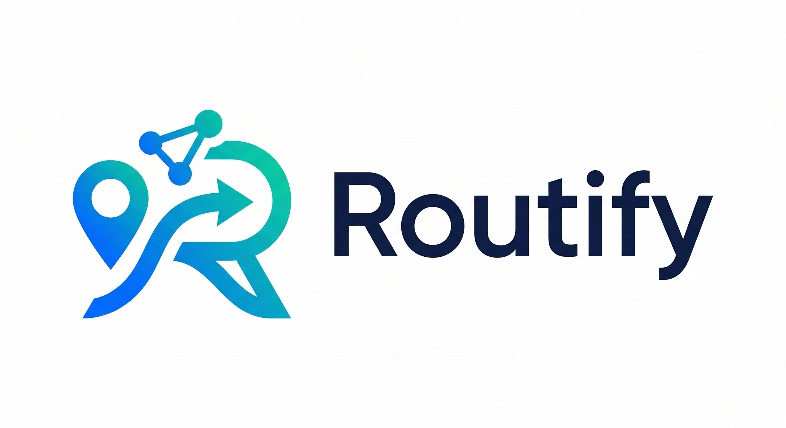

<div align="center">
  

  # Routify - Back-End (Servidor de Coleta e Roteamento)
  
  
  
  
</div>

<br/>

## 📖 Sobre o Módulo Back-End
Este é o motor de dados do projeto **Routify**. Ele é responsável por construir e atualizar o *dataset* contínuo que alimenta a inteligência de roteamento logístico. O sistema opera extraindo a topologia estática das cidades via OpenStreetMap (OSM) e realizando sondagens contínuas de telemetria de tráfego em tempo real utilizando a API da TomTom. 

Os dados são armazenados em um banco PostgreSQL hospedado no Supabase, preparando o terreno para a aplicação de algoritmos em grafos e análise preditiva de séries temporais.

## ✨ Principais Funcionalidades
* **Extração de Malha Viária:** Conexão com a Overpass API para baixar coordenadas e tipologias de vias urbanas com sistema de rotação de servidores para evitar bloqueios.
* **Monitoramento em Tempo Real:** Coleta do tráfego atual e de fluxo livre a cada 8 minutos.
* **Gestão Inteligente de Quotas (TomTom):** Rotação automática de um pool de chaves API (JSON) para contornar limites de *Rate Limit* (QPS) e cota diária — cada chave esgotada fica marcada por 24h e libera sozinha, sem precisar reiniciar o processo.
* **Inserções em Lote (Batch):** Otimização de I/O com o banco de dados Supabase para garantir inserção rápida de grandes volumes de dados de telemetria.
* **Validação experimental (Fase 3):** o mesmo processo roda `Treinamento_IA/validar_fase3.py` 4x/dia (7h, 12h, 18h, 22h), comparando a rota da LIA contra a TomTom Routing API e a rota de menor distância — ver `deploy/README.md` para rodar isso 24/7.

## 🏗️ Arquitetura do Diretório
```text
📦 BackEnd
 ┣ ...
 ┗ 📂 Servidor
   ┣ 📂 config
   ┃ ┣ 📜 .env.example                 # copie para .env e preencha
   ┃ ┗ 📜 tomtom_keys.example.json     # copie para tomtom_keys.json e preencha
   ┣ 📂 deploy                 # guia de deploy 24/7 (Oracle Cloud Free Tier) + unit systemd
   ┣ 📂 models
   ┃ ┗ 📜 db_manager.py        # Conexão e queries em lote para o Supabase
   ┣ 📂 services
   ┃ ┣ 📜 map_extractor.py     # Lógica de extração OpenStreetMap (Overpass)
   ┃ ┗ 📜 traffic_collector.py # Lógica de consumo da API TomTom
   ┣ 📜 main.py                # Orquestrador: coleta (8min) + Fase 3 (4x/dia)
   ┗ 📜 requirements.txt       # Dependências do projeto
```

## 🚀 Como Iniciar o Servidor
### 1. Pré-requisitos
- Python 3.10 ou superior instalado.
- Conta no Supabase com as tabelas de roteamento configuradas (malha_completa, vias_monitoradas, historico_trafego).
- Chaves de desenvolvedor da TomTom API.

### 2. Instalação e Configuração
#### **Passo 1:** Clone o repositório e acesse a pasta do Back-End.
```bash
git clone <url-do-repositorio>
cd Routify/BackEnd/Servidor
```

#### **Passo 2:** Instale as dependências listadas no arquivo `requirements.txt`.
```bash
pip install -r requirements.txt
```

#### **Passo 3:** Configure as variáveis de ambiente.
```bash
cd config
cp .env.example .env
```
Preencha `.env` com as credenciais do Supabase (Dashboard → Settings → API):
```bash
SUPABASE_URL=sua_url_do_supabase
SUPABASE_KEY=sua_anon_key_do_supabase
```

#### **Passo 4:** Adicione suas chaves da TomTom.
```bash
cp tomtom_keys.example.json tomtom_keys.json
```
Preencha `tomtom_keys.json` com uma ou mais chaves reais:
```json
{
  "tomtom_keys": [
    { "id": "key_01", "key": "sua_chave_aqui" },
    { "id": "key_02", "key": "sua_outra_chave_aqui" }
  ]
}
```

### 3. Executando o Coletor
#### Para iniciar o pipeline de extração e o agendamento de telemetria contínua, execute o orquestrador na raiz do módulo `BackEnd`:
```bash
python main.py
```
#### O sistema iniciará o log no console, atualizará a base cartográfica e entrará em repouso dinâmico, acordando a cada 8 minutos para gravar novos dados de tráfego no banco de dados. Para encerrar a execução de forma segura, utilize `Ctrl + C`.

## 🚨 Troubleshooting

| Erro | Causa | Solução |
|---|---|---|
| `supabase.exceptions.AuthApiError: Invalid API key` | Key/URL erradas em `.env` | Conferir `config/.env` — usar `anon key` completa, URL com `https://` |
| `KeyError: 'tomtom_keys'` | Estrutura do JSON errada | Conferir `config/tomtom_keys.json` segue `{ "tomtom_keys": [...] }` |
| `429 Too Many Requests` repetido | Pool exaurido (todas as chaves no rate limit) | Adicionar mais chaves no JSON. Limite TomTom free = 2.500 req/dia/chave |
| Coletor trava sem log | Overpass API offline ou rede lenta | Reiniciar. `map_extractor.py` rotaciona servidores Overpass automaticamente |
| `psycopg2.OperationalError: SSL connection closed` | Conexão Supabase caiu | Reiniciar processo. `db_manager.py` reconecta no próximo lote |
| Inserts duplicados no Supabase | Constraint UNIQUE faltando | Adicionar constraint `(id_ponto, data_hora)` em `historico_trafego` |
| Memória alta após horas rodando | Histórico em RAM crescendo | Diminuir `CHUNK_SIZE` em `db_manager.py`. Flush mais frequente |
| `ModuleNotFoundError: postgrest` | `supabase-py` não instalado | `pip install supabase` ou `pip install -r requirements.txt` |
| Coletor não acorda após Ctrl+Z | Job suspenso, não morto | Use `Ctrl+C` (SIGINT) — não `Ctrl+Z` (SIGSTOP) |

## 🔍 Logs Esperados

```
[2026-05-06 14:00:00] === Routify Coletor iniciado ===
[2026-05-06 14:00:01] Carregando pool de chaves TomTom (3 chaves)
[2026-05-06 14:00:02] Conectando ao Supabase...
[2026-05-06 14:00:03] Atualizando malha viária via Overpass...
[2026-05-06 14:01:45] Malha completa: 4823 nós, 12041 arestas
[2026-05-06 14:01:46] Iniciando ciclo de telemetria (8min interval)
[2026-05-06 14:09:47] Ciclo concluído: 602 pontos, 8 chaves usadas
```

<div align="center">
  

 <i>Desenvolvido para o avanço em Cidades Inteligentes e Logística Preditiva.</i>
</div>
