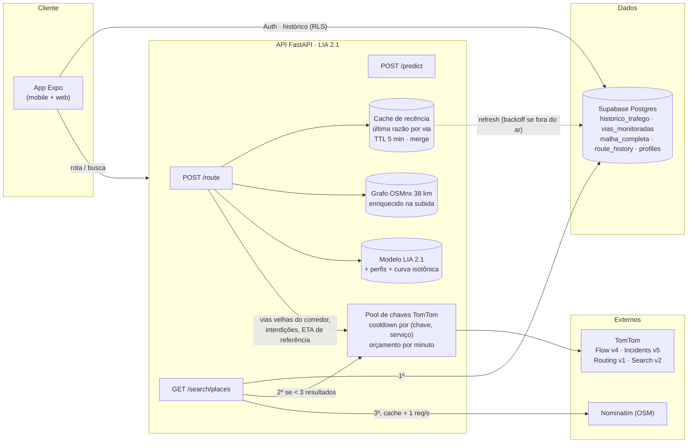
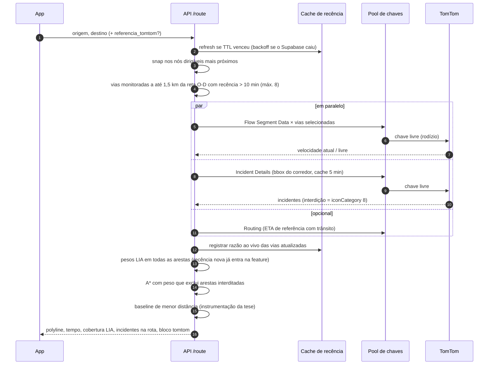

# Arquitetura — Routify

**Última revisão:** 2026-09-22

Visão de ponta a ponta do sistema na fase final do TCC 2: a coleta contínua para e a TomTom passa a ser consultada **sob demanda**, complementando a LIA (XGBoost) na hora de cada rota. Este documento atende ao item 3 do orientador: fluxo da API com o cache de recência, a rotação defensiva de chaves e o fallback da busca de endereços.

## 1. Componentes

| Componente | Arquivo | Papel |
|---|---|---|
| Grafo + enriquecimento | `apps/api/main.py`, `graph_enrichment.py` | Carrega o grafo (cache graphml), filtra vias não dirigíveis, anexa velocidade livre e o vínculo de cada aresta com a via monitorada mais próxima (BallTree, raio de 500 m). |
| Modelo LIA 2.1 | `lia_inference.py`, `ml/artifacts/` | Prevê a razão de congestionamento por via; o tempo em segundos sai do comprimento real de cada aresta. |
| Cache de recência | `recency_cache.py` | Última observação real por via (`razao_lag1`, `delta_min_lag1`). Faz merge (a leitura ao vivo vence o banco) e aplica backoff quando o Supabase cai. |
| TomTom sob demanda | `tomtom.py` | Pool de chaves, clientes HTTP, caches e as funções geométricas (corredor, interdições, incidentes na rota). |
| Knowledge Transfer | `routers/route.py` | Aresta a até 500 m de uma via monitorada herda o padrão dela, com a confiança da curva isotônica (`transfer_confidence_isotonic.pkl`). |

## 2. Fluxo do `POST /route`

**Modo degradado.** Se não há chave configurada, todas estão em cooldown, o orçamento do minuto estourou ou a TomTom falha, o passo 5 devolve vazio: a rota sai só com a LIA (perfil histórico + última recência conhecida) e `tomtom.degradado = true`. Uma falha da TomTom nunca vira erro para o usuário.

## 3. Rotação defensiva de chaves

| Situação | Detecção | Ação |
|---|---|---|
| QPS excedido | HTTP 429, ou texto com "qps" | cooldown de 2 s só daquela chave naquele serviço; a próxima chave assume |
| Cota esgotada | 403/429 com texto de cota, ou **3 respostas 429 seguidas** na mesma chave/serviço | cooldown de 24 h (janela rolante; a cota free é mensal por API, então vira uma re-sondagem diária) |
| Chave inválida | 401/403 sem texto de cota | cooldown de 10 min |
| Erro de rede / 5xx | exceção httpx / status ≥ 500 | não penaliza a chave; a chamada falha e a rota degrada |
| Abuso | mais de `TOMTOM_MAX_CHAMADAS_MIN` chamadas/min (padrão 120) | corta as chamadas até a janela liberar |

Por que o cooldown é **por serviço**: a cota free da TomTom é mensal e separada por API (Flow 20 mil, Incidents 2,5 mil, Search 2,5 mil, Routing 20 mil por chave, segundo a página de pricing em set/2026). Esgotar Incidents numa chave não tira o Flow dela. O valor da chave nunca aparece em log, só o id.

O coletor (`services/collector/traffic_collector.py`, pausado) segue a mesma política: cooldown graduado e janela de 24 h para cota.

## 4. Busca de endereços (autocomplete)

1. **Base local DF** — `malha_completa` (~38 mil vias), `ILIKE` no Supabase.
2. **TomTom Search v2** — só se a base local trouxe menos de 3 resultados; `typeahead`, `countrySet=BR`, viés para Brasília (raio de 40 km), cache de 24 h por consulta normalizada. O texto do usuário é codificado no caminho da URL (`quote(..., safe="")`).
3. **Nominatim** — último recurso, com cache de 24 h e trava de 1 requisição por segundo. A política de uso da OSMF proíbe autocomplete e exige cache.

## 5. Dados e treino (offline)

`silver.py` puxa `historico_trafego` do Supabase para parquet → `features.py` (perfis via×hora×dia, recência) → `train.py` (XGBoost, TimeSeriesSplit de 5 folds, métricas gerais e do subconjunto congestionado) → artefatos `.pkl` (fora do git) + `*_metadata.json` (versionado). `calibrate_transfer.py` gera a curva isotônica; `benchmark_lstm_xgboost.py` e `external_validation.py` produzem as evidências da tese. `thesis_figures.py` gera as figuras do texto em `docs/figuras/`.

## 6. Pontos de falha conhecidos

- **Supabase free pausa após ~7 dias sem requisições** (aconteceu em 2026: o domínio passou a dar NXDOMAIN). Com o banco fora, o grafo sobe sem vínculo às vias e a rota cai na heurística. Mitigação: workflow de keep-alive + snapshot local de `vias_monitoradas` (pendente).
- **API sem autenticação e CORS aberto** — ver CLAUDE.md §5. O orçamento por minuto da TomTom é a única barreira contra o consumo de cota até a auth entrar.
