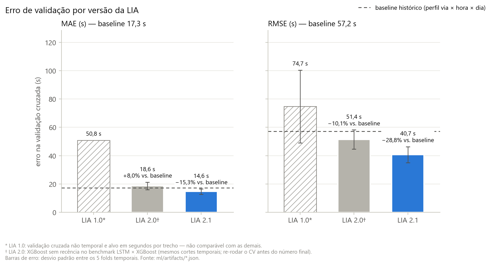
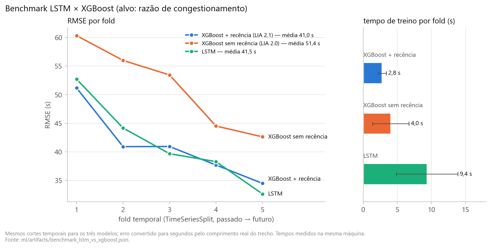
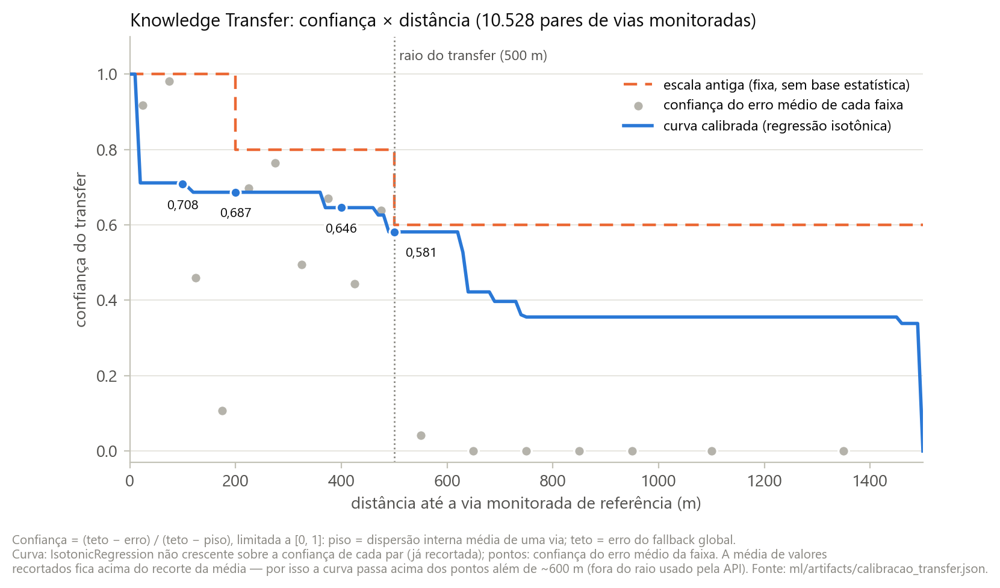
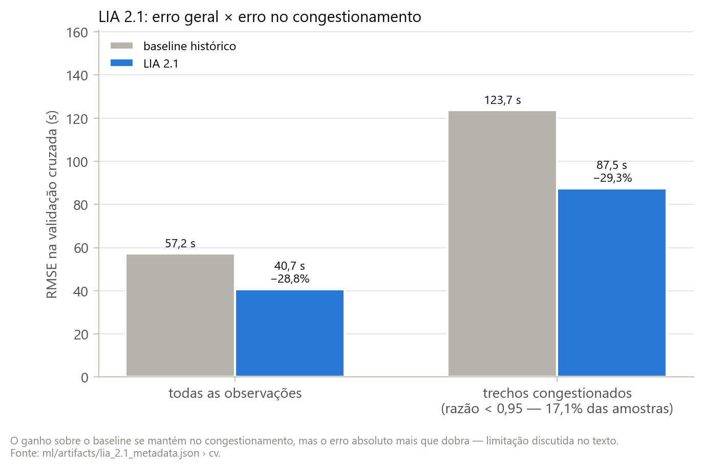

# Resultados, calibração e limitações — rascunho para o texto final

**Última revisão:** 2026-09-23

> **Status: rascunho.** Redigido com apoio de IA a partir dos artefatos versionados do repositório (`ml/artifacts/*.json`), para atender às recomendações do orientador sobre a seção de Resultados e Discussão. A equipe deve revisar, reescrever com a própria voz e declarar o uso de IA conforme as normas da instituição. Todo número abaixo aponta para a chave do JSON de origem; as figuras são geradas por `ml/thesis_figures.py` e se atualizam sozinhas quando os JSONs mudarem.

## 1. Métricas

O desempenho é medido em **segundos de tempo de viagem por trecho**. O modelo prevê a razão de congestionamento r = vatual / vlivre ∈ [0,05; 1]; o tempo previsto é t̂ = L / (vlivre · r̂), em que L é o comprimento real do trecho.

- **MAE** = (1/n) Σ |ti − t̂i| — erro típico, em segundos.
- **RMSE** = √[(1/n) Σ (ti − t̂i)²] — penaliza mais os erros grandes, que concentram-se justamente nos trechos congestionados.

Reportar as duas métricas mostra se um ganho vem de reduzir erros típicos (MAE) ou erros grandes (RMSE). A validação é **cruzada temporal** (TimeSeriesSplit, 5 folds): cada fold de validação é um período posterior ao de treino.

**Baseline histórico:** a mediana da razão observada para a mesma via, hora e dia da semana (com a cascata de generalização via+hora+dia → via+hora → via → hora+dia → global). É o que um sistema sem aprendizado de máquina faria com os mesmos dados.

> **Correção para o texto:** a coluna "Erro médio" do Resumo Técnico (74,7 / 51,3 / 40,7 s) corresponde ao **RMSE**. A Tabela 1 traz as duas métricas.

## 2. Evolução da LIA (Tabela 1, Figura 1)

**Tabela 1 — Erro na validação cruzada por versão**

| Versão | Validação | MAE (s) | RMSE (s) | RMSE × baseline | Fonte |
|---|---|---|---|---|---|
| LIA 1.0 | não temporal (inválida) | 50,8 | 74,7 | não comparável | `lia_1.0_supabase_metadata.json` › `cv_mae_medio_seg`, `cv_rmse_medio_seg` |
| Baseline histórico | temporal | 17,3 | 57,2 | — | `lia_2.1_metadata.json` › `cv.baseline_mae_seg`, `cv.baseline_rmse_seg` |
| LIA 2.0 | temporal | 18,6 | 51,4 | −10,1% | `benchmark_lstm_vs_xgboost.json` › `xgboost.mae_seg_media`, `rmse_seg_media` |
| LIA 2.1 | temporal | 14,6 | 40,7 | **−28,8%** | `lia_2.1_metadata.json` › `cv.modelo_mae_seg`, `cv.modelo_rmse_seg` |

*Figura 1 — MAE e RMSE da validação cruzada por versão da LIA, comparados ao baseline histórico (linha tracejada). Barras de erro: desvio padrão entre os 5 folds temporais.*

**Leitura.**
- **LIA 1.0 não é comparável.** A validação cruzada separava vias, e não períodos. Além disso, o alvo era o tempo de um trecho de comprimento fixo, e as features de defasagem eram fabricadas em produção.
- **LIA 2.0 reduz o RMSE em 10,1%, mas tem MAE 8,0% pior que o baseline.** Ela diminui os erros grandes sem melhorar o erro típico.
- **LIA 2.1 melhora as duas métricas** (MAE −15,3%, RMSE −28,8%). O ganho vem da feature de recência: a última observação real da via e o tempo decorrido desde ela.

**Cuidados antes da versão final:**
- Os números da LIA 2.0 vêm do benchmark (XGBoost sem recência, mesmos cortes temporais), porque o `lia_2.0_metadata.json` não persistiu o CV.
- O CV da LIA 2.1 foi calculado antes da adoção dos hiperparâmetros otimizados pelo Optuna.
- Recomenda-se re-rodar `train.py` para as duas versões e regerar as figuras.

## 3. Benchmark LSTM × XGBoost (Figura 3)

*Figura 3 — RMSE por fold temporal e tempo médio de treino por fold, para o XGBoost sem recência (LIA 2.0), o LSTM e o XGBoost com recência (LIA 2.1).*

| Modelo | RMSE médio (s) | MAE médio (s) | Treino por fold (s) |
|---|---|---|---|
| XGBoost sem recência | 51,4 | 18,6 | 4,0 |
| LSTM (janela de 6 passos, 10.833 parâmetros) | 41,5 | 17,2 | 9,4 |
| XGBoost + recência | 41,0 | 14,6 | 2,8 |

Fonte: `benchmark_lstm_vs_xgboost.json` (`rmse_seg_media`, `mae_seg_media`, `tempo_treino_s_media`, `n_parametros_lstm`).

A vantagem aparente do LSTM vinha do acesso à última observação real da via, não da captura de sazonalidade longa. Com a mesma informação (duas features de recência), o XGBoost empata no RMSE (41,0 × 41,5 s), vence no MAE (14,6 × 17,2 s) e treina em cerca de um terço do tempo. Pelo princípio da parcimônia, o XGBoost foi mantido em produção: não exige GPU nem runtime PyTorch no servidor. (Para registro honesto: o arquivo do LSTM é menor, 46 KB contra 1,35 MB do XGBoost.)

## 4. Estudo de caso — calibração da confiança do Knowledge Transfer (Figura 2)

Vias sem monitoramento herdam o padrão de congestionamento da via monitorada mais próxima, dentro de 500 m. A razão herdada é puxada para o fluxo livre conforme a confiança c(d):

raresta = c(d) · rvizinha + (1 − c(d)) · 1

**Método** (`calibrate_transfer.py`):
- Foram comparados **10.528 pares** de vias monitoradas, medindo o erro entre seus perfis históricos em função da distância d.
- A confiança de cada par é (teto − erro) / (teto − piso), limitada a [0, 1]:
  - **piso** é a dispersão interna média de uma via (confiança 1);
  - **teto** é o erro de usar o fallback global (confiança 0).
- Uma regressão isotônica não crescente foi ajustada sobre os pares. Ela impõe só que a confiança não cresça com a distância, sem forma funcional arbitrária.

*Figura 2 — Confiança do Knowledge Transfer em função da distância: escala antiga (fixa), confiança do erro médio de cada faixa e curva calibrada por regressão isotônica.*

| Distância | Escala antiga | Escala calibrada | Diferença |
|---|---|---|---|
| 100 m | 1,0 | 0,708 | −29% |
| 200 m | 0,8 | 0,687 | −14% |
| 400 m | 0,8 | 0,646 | −19% |
| 500 m | 0,6 | 0,581 | −3% |

Fonte: `calibracao_transfer.json` › `curva_isotonica_grade_10m`, `constante_antiga`.

**Leitura.** A escala antiga era otimista em toda a faixa usada pela API: transferia mais padrão de congestionamento do que os dados sustentam.

**Ponto metodológico a registrar.** A curva foi ajustada sobre a confiança de cada par **já recortada em [0, 1]**, e a média de valores recortados fica acima do recorte da média. Por isso:
- Além de ~600 m, a curva fica em ~0,36, enquanto a confiança do erro médio das faixas é 0.
- Dentro do raio de 500 m o efeito é menor, mas existe: a média simples das faixas entre 100 e 500 m é ≈ 0,53, contra 0,58–0,71 da curva.

Vale citar como limitação da calibração, com ajuste futuro sobre os erros não recortados (ou sobre as faixas ponderadas pelo número de pares).

## 5. Validação externa (Fase 3)

A Fase 3 compara, para o mesmo par origem-destino e no mesmo instante:
- a rota da LIA;
- a rota de menor distância;
- a rota da TomTom Routing API com trânsito ao vivo.

**Tempo total de viagem.** A diferença entre o sistema e a TomTom é sistemática e proporcional à distância, mesmo sem congestionamento. Isso é atribuído à espera em cruzamentos semaforizados, que não é modelada.

**Redesenho da comparação.** Por isso, a comparação passou a isolar o **atraso por congestionamento**: o tempo previsto no pico menos o tempo previsto em horário de referência sem tráfego. A primeira rodada em pico real mostrou concordância direcional, com os corredores mais congestionados apresentando mais atraso nas duas fontes. A magnitude, porém, é subestimada pelo sistema nos casos mais congestionados.

**Continuidade após a parada do coletor.** O experimento rodava dentro do processo do coletor, que está sendo pausado. A API agora aceita `referencia_tomtom: true` no `POST /route` e devolve o ETA e o atraso da TomTom junto com a previsão da LIA. Assim, a comparação pode continuar acumulando amostras a partir do uso real.

## 6. Limitações conhecidas

1. **Semáforos e velocidade livre** *(atualizado em 2026-09-23 — números em `ml/artifacts/semaforos_calibracao.json`; a validar pelo grupo)*.
   - A soma de arestas não modela a espera em cruzamento semaforizado, o que gera viés proporcional à distância no tempo total (Fase 3). Por isso a validação externa usa o atraso por congestionamento, não o tempo absoluto.
   - **Tratamento implementado:**
     - semáforos do OSM (`highway=traffic_signals`, 423 no DF) encaixados no cruzamento do grafo (271 cruzamentos; a simplificação do OSMnx guardava só 114);
     - atraso médio por semáforo calibrado contra a TomTom no **mesmo trajeto** (reconstrução por `supportingPoints`), em 60 pares O-D sorteados com semente fixa;
     - OLS sem intercepto: `TomTom sem trânsito − LIA ≈ δ·semáforos + β·km`.
   - **Resultado:** δ = 22,9 s (erro-padrão 15,7 s), compatível com a faixa do HCM para LOS C (20–35 s), mas estatisticamente fraco. β = 22,9 s/km, com R² ≈ 0.
     - Leitura: a maior parte da diferença não vem dos semáforos. É um viés por quilômetro da **velocidade livre**.
     - Causa: na inferência, a API usa o limite de via do OSM (`speed_kph`) como velocidade livre, enquanto a LIA foi treinada com a velocidade livre da TomTom. O tempo da rota sai otimista.
     - Teste A/B com a velocidade livre da TomTom só nos trechos monitorados (`VEL_LIVRE_TOMTOM=1`), nos mesmos 60 pares: a LIA ficou 29,2% abaixo da TomTom, contra 29,7% na versão atual.
       - O ganho é desprezível porque esses trechos são poucos: o viés está nas arestas por transferência e heurística.
       - Próximo passo: calibrar a velocidade livre por classe de via.
   - **Limitação da coleta:** a calibração foi feita de madrugada; repetir em horário comercial e estratificar por região.
2. **Subestimação em congestionamento extremo** (Figura 4).
   - No subconjunto congestionado (razão < 0,95; 17,1% das amostras), o RMSE da LIA 2.1 sobe de 40,7 s para 87,5 s (2,1×).
   - A vantagem sobre o baseline se mantém (123,7 s; −29,3%).
   - Causas prováveis:
     - desbalanceamento, já que 83% das amostras estão em fluxo livre;
     - perda quadrática, que puxa previsões para a média;
     - piso da razão em 0,05;
     - ausência de recência fresca em produção desde a parada da coleta, hoje mitigada pela consulta à TomTom sob demanda.
3. **Coleta não contínua.**
   - A coleta teve lacunas e foi encerrada em 19/07/2026.
   - O projeto Supabase gratuito foi pausado por inatividade depois disso.
   - Os perfis históricos refletem o período coletado (março a julho de 2026) e não capturam sazonalidade anual.
4. **Proveniência das métricas.** A LIA 2.0 é reportada pelo benchmark, e o CV da LIA 2.1 é anterior ao Optuna (seção 2).
5. **Knowledge Transfer.**
   - Limitado a 500 m.
   - A curva calibrada tem o viés de recorte descrito na seção 4.
   - Vias além do raio usam só a mediana global do horário.
6. **Dependência de API comercial.**
   - A cota gratuita da TomTom é mensal e por API (Flow 20 mil, Incidents 2,5 mil, Search 2,5 mil, Routing 20 mil).
   - O sistema usa um pool de chaves com rotação automática. Os termos da TomTom (§14.2) permitem suspender contas criadas para obter requisições gratuitas adicionais, então o pool é um risco declarado, adequado apenas a um protótipo acadêmico.
7. **Cobertura.** O grafo cobre um raio de 38 km, e os 630 pontos monitorados concentram-se em vias arteriais (motorway, trunk e primary).
8. **Sem modo offline** (cache local de rota) neste ciclo.

*Figura 4 — RMSE da LIA 2.1 e do baseline histórico em todas as observações e apenas nos trechos congestionados.*

## 7. Trabalhos futuros

- **Semáforos:** implementado em 2026-09-23 (ver limitação 1). Falta repetir a calibração de dia, por região, e com a velocidade livre corrigida.
- **Velocidade livre na inferência:** usar a velocidade livre da TomTom (a do treino) também nas arestas por transferência, e calibrar a do OSM por classe de via.
- **Fusão LIA × TomTom:** implementada. A TomTom reconstrói a rota da LIA e mede o ETA ao vivo do mesmo trajeto, e o tempo exibido mistura as duas fontes pela cobertura da LIA. Avaliar o erro dessa estimativa contra o tempo real informado pelos usuários.
- **Features de contexto:** vizinhos monitorados em t−1, chuva (Open-Meteo), feriados (BrasilAPI) e incidente ativo por perto.
- **Cauda de congestionamento:** ponderação das amostras congestionadas, perda quantílica (P90) ou modelo específico para razão < 0,5.
- **Coleta orientada por demanda:** persistir as leituras ao vivo da TomTom feitas durante o uso (com a fonte identificada) para re-treino, sem varredura contínua.
- **Incidentes como sinal calibrado:** hoje só a interdição bloqueia arestas; acidentes e obras poderiam virar penalidade aprendida.
- **Calibração do transfer** sem o viés de recorte (seção 4).
- **Operação:** hospedagem 24/7 da API, keep-alive do banco, modo offline e busca dedicada (por exemplo, ElasticSearch) se a escala exigir.
